<div align="center">

  <!-- Animated Typing Header -->
  <a href="https://mr-saransh.github.io/Mr-Saransh/">
    
  </a>

  <br/>

  <!-- Hero Banner SVG -->
  <a href="https://mr-saransh.github.io/Mr-Saransh/">
    
  </a>

  <br/><br/>

  <!-- Quick Action Badges Row -->
  <a href="https://mr-saransh.github.io/Mr-Saransh/">
    
  </a>
  &nbsp;
  <a href="https://linkedin.com/in/mr-saransh">
    
  </a>
  &nbsp;
  <a href="mailto:saranshagrahari1221@gmail.com">
    
  </a>
  &nbsp;
  <a href="https://github.com/Mr-Saransh">
    
  </a>

  <br/><br/>

  <!-- Profile Views & Stars -->
  
  &nbsp;
  

</div>

<br/>

---

<div align="center">
  
</div>

<br/>

##  About Me

```js
const saransh = {
    title: "Full Stack Developer & Software Engineer",
    education: {
        degree: "B.Tech CSE — MERI College of Engineering & Technology (MDU)",
        status: "5th Semester (Ongoing)",
        distinction: "Ranked 1st in Semester II & IV among CSE students"
    },
    stack: ["Next.js", "React", "TypeScript", "PostgreSQL", "Prisma ORM", "WebSockets", "Python", "Flask"],
    awards: ["🥇 1st Prize MERI-CET Project Competition", "🏆 Best Student Innovator — Startup Carnival Haryana 2026"],
    motto: "Build systems that scale. Ship products that matter."
};
```

<br/>

---

##  Interactive Arcade Mini-Game

> **🎮 Exclusive**: A fully playable **Cyber Gold Defender** space combat arcade game — built entirely with HTML5 Canvas 2D & Web Audio API. Zero external dependencies.

<div align="center">
  <a href="https://mr-saransh.github.io/Mr-Saransh/#arcade">
    
  </a>

  <br/><br/>

  <a href="https://mr-saransh.github.io/Mr-Saransh/">
    
  </a>
</div>

<details>
<summary><b>🕹️ Game Features & Controls</b> (click to expand)</summary>
<br/>

| Feature | Detail |
| :--- | :--- |
| **Engine** | HTML5 Canvas 2D @ 60 FPS |
| **Audio** | Web Audio API procedural synthesizer — lasers, explosions, power-ups, coin pickups |
| **Enemies** | BUG#404, LATENCY spikes, MEMORY LEAK tanks — each with unique behavior |
| **Power-ups** | Golden crystals → Laser Overdrive (triple beam spread) |
| **Controls** | Mouse / Touch drag + WASD / Arrow keys + Spacebar / Tap to fire |
| **Mobile** | Full touch support with passive:false for smooth gameplay |
| **CRT Mode** | Toggleable retro scanline filter |
| **High Score** | Persisted via localStorage |

</details>

<br/>

---

##  Career Impact & Milestones

<div align="center">
  
</div>

<br/>

---

##  Featured Production Projects

<table>
  <tr>
    <td width="50%" valign="top">
      <h3>🏗️ Apni Estate — Construction ERP & CRM</h3>
      <p>
        
        
        
        
        
      </p>
      <ul>
        <li>Multi-tier role-based dashboards (Builders, Supervisors, Project Managers, Accountants, Sales, Admin).</li>
        <li>Automated workflows: inventory management, attendance tracking, vendor procurement, purchase orders, billing, and project progress monitoring.</li>
        <li>Responsive interfaces and scalable data architecture for heavy real-world construction logistics.</li>
      </ul>
    </td>
    <td width="50%" valign="top">
      <h3>⚡ ACTIFY — Execution Enforcement Platform</h3>
      <p>
        
        
        
        
      </p>
      <ul>
        <li>Novel productivity engine converting aspirations into mandatory daily execution backed by proof-based task verification.</li>
        <li>Gamified accountability: <b>ACT Points</b>, <b>ACT Currency</b>, dynamic leaderboards, streaks, penalties, and automated task-locking.</li>
        <li>Shipped functional MVP with iterative feature deployments based on live user feedback.</li>
      </ul>
    </td>
  </tr>
  <tr>
    <td width="50%" valign="top">
      <h3>🌐 COACT — Real-Time Group Interaction</h3>
      <p>
        
        <br/>
        
        
        
        
      </p>
      <ul>
        <li>Real-time collaborative hub: group study, live classroom interactions, synchronized quizzes, polls, and interactive decision-making.</li>
        <li>Sub-50ms WebSocket synchronization for live multiplayer trivia, participant presence tracking, and voting leaderboards.</li>
        <li>Features: <i>Trivia Night</i>, <i>Word Chain</i>, and collaborative Q&A boards.</li>
      </ul>
    </td>
    <td width="50%" valign="top">
      <h3>🩺 AI Telemedicine Application</h3>
      <p>
        
        
        
        
      </p>
      <ul>
        <li>Voice-first AI healthcare assistant engineered for low-literacy and multilingual accessibility in underserved communities.</li>
        <li>Conversational symptom guidance powered by NLP to decode patient queries into medical insights.</li>
        <li>Speech-centric interface minimizing reliance on dense text navigation for maximum accessibility.</li>
      </ul>
    </td>
  </tr>
  <tr>
    <td colspan="2" valign="top">
      <h3>🏨 ATITHI — Guest House Management SaaS</h3>
      <p>
        
        
        
        
        
        
      </p>
      <ul>
        <li>Full-cycle SaaS for guest house hospitality: room inventory allocations, customer records, and administrative reservations.</li>
        <li>Role-based authentication, admin dashboards, and database-driven automated booking pipelines.</li>
      </ul>
    </td>
  </tr>
</table>

<br/>

---

##  Technical Arsenal

<div align="center">
  
</div>

<br/>

<div align="center">

  <!-- Tech Stack Shields - Animated Row -->
  
  
  
  
  
  
  <br/>
  
  
  
  
  
  

</div>

<br/>

---

##  Honors & Achievements

<table>
  <tr>
    <td align="center" width="25%">
      <br/>
      <b>Software Category</b><br/>
      <sub>MERI-CET Project Competition<br/>for <i>COACT</i></sub>
    </td>
    <td align="center" width="25%">
      <br/>
      <b>Best Student Innovator</b><br/>
      <sub>Startup Carnival Haryana 2026<br/>State-Level Competition</sub>
    </td>
    <td align="center" width="25%">
      <br/>
      <b>Sem II & Sem IV</b><br/>
      <sub>CSE Department Topper<br/>MERI-CET (MDU)</sub>
    </td>
    <td align="center" width="25%">
      <br/>
      <b>MERI Project Competition</b><br/>
      <sub>Outstanding Software<br/>Architecture</sub>
    </td>
  </tr>
</table>

<br/>

---

##  Leadership & Community

| Role | Event | Year |
| :--- | :--- | :---: |
| 🛰️ **Technical Assistance Volunteer** | Indian Space Congress 2026 | 2026 |
| 🛰️ **Technical Assistance Volunteer** | DefSAT 2026 | 2026 |

<br/>

---

##  GitHub Activity & Insights

<div align="center">

  <!-- GitHub Trophies -->
  <a href="https://github.com/ryo-ma/github-profile-trophy">
    
  </a>

  <br/><br/>

  <!-- GitHub Stats Row -->
  <table>
    <tr>
      <td>
        
      </td>
      <td>
        
      </td>
    </tr>
  </table>

  <br/>

  <!-- Streak Stats -->
  <a href="https://github.com/Mr-Saransh">
    
  </a>

  <br/><br/>

  <!-- Activity Graph -->
  <a href="https://github.com/Mr-Saransh">
    
  </a>

</div>

<br/>

---

##  Education

| | Detail |
| :---: | :--- |
| 🎓 | **Bachelor of Technology (B.Tech) — Computer Science & Engineering** (2024 – 2028, Currently 5th Sem) |
| 🏫 | MERI College of Engineering & Technology — Affiliated to Maharshi Dayanand University (MDU) |
| 📊 | Ranked **1st in Semester II & IV** — CSE Department |
| 📜 | **Class XII (CBSE)**: 88% |

<br/>

---

<div align="center">

  <!-- Footer Typing -->
  

  <br/><br/>

  <!-- Bottom Links -->
  <a href="https://mr-saransh.github.io/Mr-Saransh/">
    
  </a>
  &nbsp;•&nbsp;
  <a href="https://github.com/Mr-Saransh">
    
  </a>
  &nbsp;•&nbsp;
  <a href="https://linkedin.com/in/mr-saransh">
    
  </a>
  &nbsp;•&nbsp;
  <a href="mailto:saranshagrahari1221@gmail.com">
    
  </a>

  <br/><br/>

  

</div>
